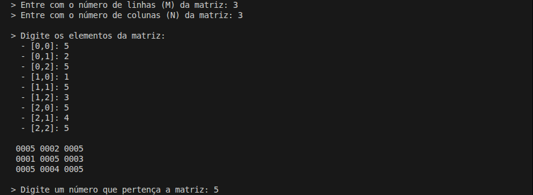
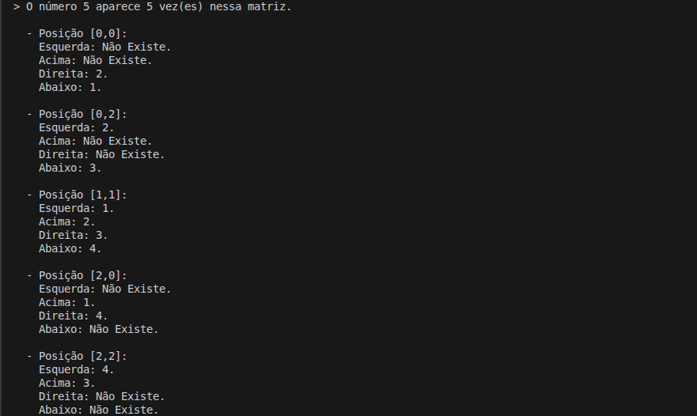

# Sistema Simples de Manipulação de Matrizes

Programa para leitura e analise de uma matriz inteira, localizando todas as ocorrencias de um valor informado e exibindo os elementos vizinhos de cada posicao encontrada.

## Detalhes Gerais

- **Versão**: 0.1
- **Conceito aplicado:** Encapsulamento de Matrizes

## Descrição da Tag

Implementacao inicial do problema utilizando orientacao a objetos e separacao basica de responsabilidades.

A classe Matriz encapsula a estrutura bidimensional de dados e concentra operacoes de insercao, busca de ocorrencias e coleta de vizinhos de cada posicao encontrada.

A classe MatrizInputs ficou responsavel pela criacao da matriz a partir da entrada do usuario, enquanto ProgramExamples organiza o fluxo principal de leitura, exibicao e analise dos elementos.

Essa versao estabelece a base do projeto com modelagem orientada a objetos para manipulacao de matrizes.

## Exemplo de Execução

